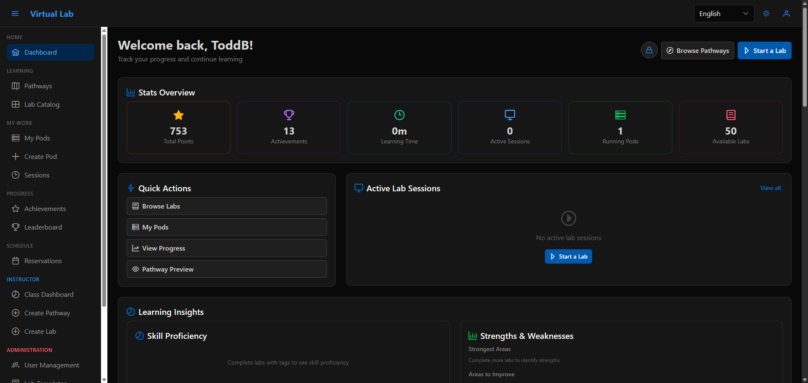

# Kootenai

> ## Status: Archived and unmaintained
>
> Issues and pull requests are closed and nothing here will be fixed. It is published
> as-is so the work is useful to someone else. **Forks are welcome** — take what you want,
> no need to ask.
>
> It is a working, tested cyber-range / lab-orchestration platform: the Go API passes 5,536
> tests across 60 packages (51 of which contain tests; the other 9 report `[no test files]`)
> and the frontend 1,104 across 66 suites, CI was green at
> archiving, and the Proxmox path has been driven against real hardware. It is **not**
> production-hardened, security-audited, or supported, and it ran at one institution rather
> than at scale. Read [State of the project](#state-of-the-project) before building on it.
> Apache 2.0, no warranty, no roadmap.

An open-source, self-hostable platform for cybersecurity and network-operations lab
teaching — roughly, a self-run alternative to Hack The Box or TryHackMe that plugs into
your LMS.

Instructors define labs as YAML templates (VMs, network topology, snapshot points, graded
objectives). Students each get an isolated **pod** — a live instance with its own cloned VMs
and network segment. Progress is detected via **checkpoints** (filesystem and command
triggers observed by a Wazuh/OSSEC agent inside the VMs). Canvas grade passback over LTI 1.3
is fully implemented but **disabled in this build** — read
[Known gaps](#state-of-the-project) before you plan around it. It targets **Proxmox** for labs
needing fast snapshot/revert and **Apache CloudStack** for cloud-infrastructure coursework.



---

## Try it without a hypervisor

Neither path provisions a real VM — that genuinely requires a hypervisor.

**The whole UI, no backend (~2 min).** A build-time mock mode serves every API call from
fixtures. Log in with **any** email and password; you get both `student` and `instructor`
roles, every view and i18n, but no persistence, real auth or VMs.

```bash
cd web && npm install
VITE_USE_MOCK_DATA=true npm run dev        # http://localhost:3000
```

**Real API and database, no hypervisor (~10 min).** The actual Go API against real Postgres
and NATS — real endpoints, migrations and persistence.

```bash
cp deploy/.env.example .env
docker compose -f docker-compose.dev.yml up -d      # Postgres + NATS

cd api
AUTH_DEMO_MODE=true \
AUTH_DEMO_MODE_CONFIRM=I_UNDERSTAND_THE_RISKS \
AUTH_DEMO_ROLE=instructor \
go run ./cmd/labctl serve
```

Then `cd web && npm install && npm run dev`; it targets port 8080 by default. The confirm
variable really is required, and the API hard-fails if `ENV` is `production` — demo mode
authenticates *every* request as `demo-user`. Migrations run on `serve`; seed with
`mage db:seed`. **Pod provisioning will fail** without a hypervisor; browsing, CRUD,
templates and sessions all work.

> **A trap worth naming:** `MOCK_PROXMOX` / `MOCK_CLOUDSTACK` appear in the quickstart and
> read as a hypervisor-free demo. **They are inert** — parsed into config, but nothing in
> non-test code calls the methods they feed. Writing a mock behind the orchestrator's
> platform interface is probably the single highest-value thing a fork could add.

---

## Real setup

Stand up an "infra VM" running the control plane (API, web, Postgres, NATS, Redis) in
Docker, pointed at your existing Proxmox or CloudStack cluster; it holds no VMs itself.
`cd deploy && cp .env.example .env`, then **fill in the eight required values** before
`docker compose up -d` — `DATABASE_PASSWORD`, `NATS_PASSWORD`, `REDIS_PASSWORD`,
`JWT_SECRET`, `GRAFANA_ADMIN_PASSWORD`, `PROXMOX_HOST`, `PROXMOX_TOKEN_ID` and
`PROXMOX_TOKEN` all ship blank and are declared `${VAR:?}`, so compose aborts rather
than starting a half-configured stack. `deploy/README.md` lists them. Ansible
(`ansible/`) and `mage deploy:all` are alternatives.

Don't follow that blind — the details that matter are documented properly:

| Guide | Path (under `docusaurus/docs/`) |
|-------|------|
| Demo-mode quick start | `quickstart-demo.md` |
| Proxmox setup, VM templates | `admin/proxmox-setup.md`, `admin/proxmox-vm-templates.md` |
| Wazuh / checkpoint detection | `admin/wazuh-integration.md` |
| Production deployment | `admin/production-deployment.md` |
| Canvas LMS + LTI 1.3 | `admin/canvas-lms-integration.md` |
| API reference | `api/reference.md` |

Run the docs site with `cd docusaurus && npm install && npm start`. Canvas LTI is genuinely
fiddly; `docusaurus/docs/admin/canvas-lms-integration.md` has a troubleshooting table for the
four errors you will actually hit — but read [Known gaps](#state-of-the-project) first, because
LTI is gated off in this build and no amount of correct configuration changes that.

---

## Architecture

```
   Proxmox cluster                 CloudStack
 (fast snapshot/revert)      (cloud infra coursework)
          │                             │
          └──────────────┬──────────────┘
                         │
              Orchestration API (Go)
              Postgres · NATS · Redis
                         │
          ┌──────────────┴──────────────┐
          │                             │
   Canvas LMS (LTI 1.3)          Web UI (Vue 3)
```

Go API (single binary, `labctl`) · Vue 3 + TypeScript + Tailwind · PostgreSQL · NATS
JetStream · Redis · Python template tooling · Mage builds.

Three concepts carry the domain model. A **Lab Template** is YAML describing VMs and base
images, network segments, snapshot points and graded objectives (62 ship in `templates/`; the 63rd YAML file there,
`scenarios/incident-response.scenario.yaml`, is a labtest simulator scenario, which the
template tests exclude — `python/tests/test_parser.py:610-614`).
A **Pod** is an instantiated lab — cloned VMs on an isolated segment. A **Lab Session** is a
time-bound reservation of a pod, optionally bound to a Canvas assignment. Objectives are what
make grading work: each declares a trigger the in-VM agent can observe. See
`templates/examples/simple-linux-intro.yaml` for a commented example, and
`docs/architecture/adr/` for design decisions.

---

## State of the project

An honest inventory, for anyone deciding whether to fork.

**Works well.** Proxmox orchestration is the mature path — clone-from-template, network
isolation, snapshot/revert, noVNC/SPICE console. Also solid: the template engine and its 62
lab templates; Wazuh-driven checkpoint and objective tracking; local and LDAP auth with
HttpOnly-cookie sessions; English–Spanish i18n with CI-enforced parity; and operational
hygiene — circuit breakers and retries around both hypervisor clients, Prometheus metrics,
structured logging, a real `/ready` probe, and a 49-item security audit driven to completion
(`docs/big-audit.md`).

**Known gaps:**

- **Canvas LTI 1.3 is complete, was tested against real Canvas, and is disabled in this
  build.** Launch, deep linking and AGS grade passback are all implemented — and all sit
  behind an edition gate that nothing in this repository ever opens.
  `api/internal/enterprise/enterprise.go:144` assigns `var Default Features =
  &communityFeatures{}`, and `Default` is never reassigned: no `SetDefault`, no `init()`
  override, no build tag, no environment variable. `communityFeatures.IsEnabled` returns
  `false` unconditionally (`api/internal/enterprise/community.go:21-23`).

  State the consequence precisely, because it is not the unremarkable case of an
  unconfigured endpoint refusing to serve: **configure Canvas completely and correctly and
  LTI still will not work.** With `cfg.LTI.ClientID` set, `api/internal/server/server.go:768-772`
  takes the branch that logs one `Info` line — `LTI integration requires Enterprise Edition`
  — and never constructs the LTI service at all. The routes exist on every build regardless,
  because `server.go:1623` calls `s.canvasMgr.SetupRoutes(r)` unconditionally, but each group
  is wrapped in `middleware.RequireEnterprise(enterprise.FeatureLTI)`
  (`api/internal/server/canvas_manager.go:150` for `/lti/*`, `:165` for `/api/v1/lti/*`), which
  writes `403 Forbidden` before any handler runs (`api/internal/middleware/enterprise.go:29-31`).
  The gate is the binding constraint, not your configuration, and a single log line is the
  only feedback you get.

  **To enable it in a fork:** replace `enterprise.Default` with an implementation whose
  `IsEnabled` returns `true` for `enterprise.FeatureLTI`. Deleting the two
  `r.Use(middleware.RequireEnterprise(...))` lines at `canvas_manager.go:150` and `:165`
  is *not* sufficient on its own: `ltiService` is assigned at exactly one place
  (`server/server.go:779`), inside the `else` of the same gate check at `:769`, so the
  routes become reachable but every launch returns `503` from
  `lti_handlers.go:161-163`. Setup is documented in
  `docusaurus/docs/admin/canvas-lms-integration.md`.
- **OAuth2/OIDC is implemented, never wired in, and never tested.**
  `api/internal/auth/oauth2/` (`manager.go`, `provider.go`, `providers.go`) is a complete
  implementation containing **no `_test.go` files at all**. An HTTP layer exists too:
  `OAuth2Handlers.RegisterRoutes` — at `api/internal/server/oauth2_handlers.go:74`, in
  `internal/server/`, not in the `oauth2` package — would mount `GET /oauth2/providers`,
  `GET /oauth2/login/{provider}` and `GET /oauth2/callback/{provider}`. Neither
  `NewOAuth2Handlers` (`oauth2_handlers.go:48`) nor `RegisterRoutes` has a single call site
  anywhere in the module, tests included; the one test file builds the struct as a literal.
  **No `/oauth2/*` route is reachable on a running server.** A fork wanting OIDC needs to
  construct the handlers, call `RegisterRoutes`, and write the tests the package never had —
  but the protocol work is done.
- **CloudStack is real but lightly exercised.** Constructed in `main.go` and passed to the
  orchestrator, not a stub — but essentially all mileage is on Proxmox.
- **No fake-hypervisor mode.** You cannot provision a pod without real hardware.
- **i18n stops at English and Spanish.** RTL infrastructure is unfinished.
- **The CE/EE split is not vestigial — it is load-bearing in exactly three places.** No
  Enterprise build is distributed from this repository, but the gate it leaves behind is
  live. `middleware.RequireEnterprise` has three call sites, and all three deny: the two LTI
  route groups above, and AI classroom simulation
  (`api/internal/server/classroom_handlers.go:51`). Nothing else is gated. The other nine
  `enterprise.Feature*` constants — `multi_tenancy`, `sso`, `scim`, `cloudstack`,
  `advanced_audit`, `advanced_quotas`, `custom_analytics`, `ha_cluster`, `lab_library` — are
  declared and never checked, so the rows for them in `docusaurus/docs/enterprise.md`
  describe an intention rather than a gate. The `hasFeature('teams')` calls in the Vue app
  are a separate and working mechanism: per-organization flags in the `feature_flags` table
  seeded by migration `012_multi_tenancy.sql`, served from
  `/api/v1/organizations/{orgID}/features`. Do not read them as leftovers of the same split.
- **Scaling is untested.** Horizontal API scaling would need shared session state and
  distributed locking (Redis is in the stack but unused for this), and long VM clones should
  go through a durable job queue.

---

## Forking and reuse

Three pieces are worth lifting on their own: the **Proxmox orchestration layer**
(`api/internal/proxmox/`) — a Go client plus clone/snapshot/network-isolation logic wrapped
in circuit breakers and retries; the **LTI 1.3 integration** (`api/internal/canvas/lti.go`,
`api/internal/server/lti_*_handlers.go`) — OIDC launch, JWKS with a cached race-safe key
store, nonce replay protection, deep linking and AGS passback, tested against real Canvas;
and the **lab template schema** (`templates/`, `python/lab_templates/`), a hypervisor-agnostic
format you could retarget at Vagrant, libvirt or containers. Also self-contained: the
`labtest` E2E CLI and the checkpoint evaluator (`api/internal/checkpoint/`).

**License: Apache 2.0** (`LICENSE`; `NOTICE` lists third-party licenses). Fork, modify,
redistribute, use commercially — keep the license and NOTICE and state your changes. No CLA.

Substantial parts of this codebase were written with AI assistance.

---

## Repository layout

```
api/            Go orchestration service (the core; `labctl` binary)
web/            Vue 3 frontend
python/         Lab-template tooling      tools/labtest/  End-to-end testing CLI
templates/      62 lab templates (YAML)   deploy/         Production compose stack
ansible/        Infra VM provisioning     magefiles/      Build system (`mage -l`)
docusaurus/     Documentation site        docs/           ADRs, audits, i18n glossary
config/         Runtime + LTI configuration
```

`mage test:all` runs the suites, `mage dev:up` starts local services, `mage build:api` builds
the binary. Addresses in the docs are placeholders like `<INFRA_IP>` — the repository was
scrubbed of real hosts and credentials before publication.
