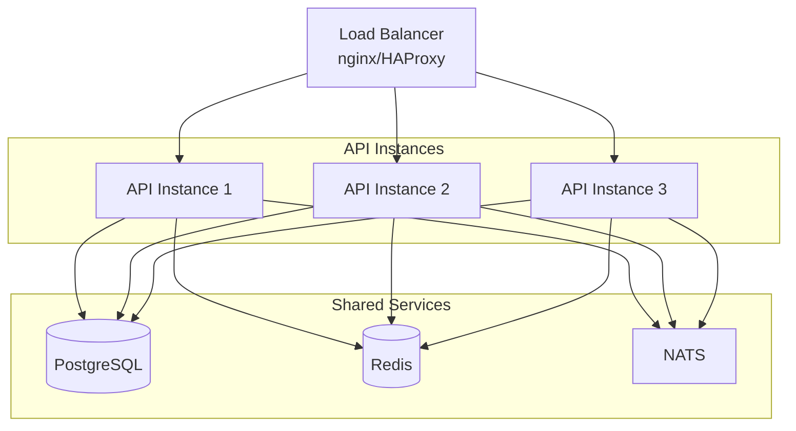
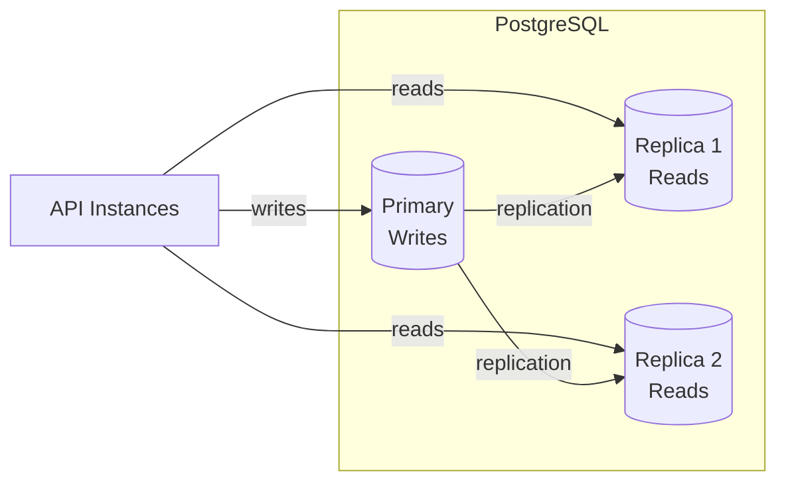
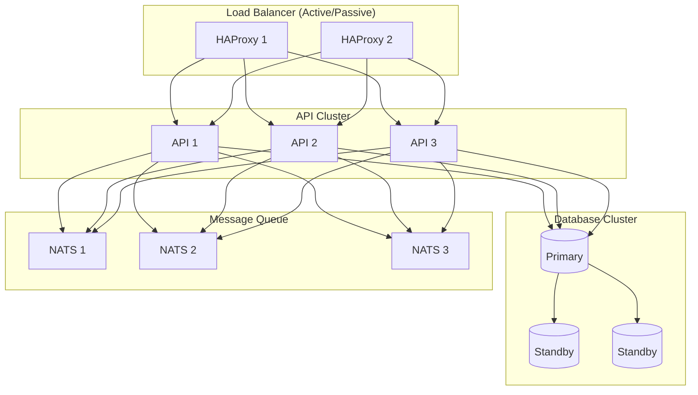

# Scaling Kootenai

This guide covers strategies for scaling Kootenai to support more users, improve performance, and ensure high availability.

## Capacity Planning

### Sizing Guidelines

| Users | API Instances | DB Size | Proxmox Nodes |
|-------|---------------|---------|---------------|
| 1-50 | 1 | 4 GB RAM | 1 |
| 50-200 | 2 | 8 GB RAM | 2-3 |
| 200-500 | 3-4 | 16 GB RAM | 4-6 |
| 500+ | 5+ | 32+ GB RAM | 8+ |

### Resource Estimates

**Per active pod:**

| Resource | Typical | Peak |
|----------|---------|------|
| CPU | 2-4 cores | 8 cores |
| RAM | 4-8 GB | 16 GB |
| Storage | 20-50 GB | 100 GB |
| Network | 10 Mbps | 100 Mbps |

**Control plane (per 100 users):**

| Component | CPU | RAM | Storage |
|-----------|-----|-----|---------|
| API | 1 core | 512 MB | 1 GB |
| PostgreSQL | 1 core | 2 GB | 10 GB |
| NATS | 0.5 core | 256 MB | 1 GB |
| Redis | 0.5 core | 1 GB | 2 GB |

## Horizontal Scaling

### API Scaling

Scale the API horizontally behind a load balancer:



#### Configuration

1. **Session Storage** - Use Redis for session state:

```yaml
# config.yaml
session:
  store: redis
  redis:
    url: redis://redis:6379
    prefix: vlab:session:
```

2. **WebSocket Affinity** - Configure sticky sessions:

```nginx
# nginx.conf
upstream api {
    ip_hash;  # Session affinity
    server api1:8080;
    server api2:8080;
    server api3:8080;
}
```

3. **Health Checks** - Use `/ready` endpoint:

```nginx
upstream api {
    server api1:8080 max_fails=3 fail_timeout=30s;
    server api2:8080 max_fails=3 fail_timeout=30s;
}

server {
    location /health {
        proxy_pass http://api/ready;
    }
}
```

### Database Scaling

#### Connection Pooling

Configure connection pool for multiple API instances:

```yaml
# Per API instance
database:
  maxOpenConns: 10    # Lower per instance
  maxIdleConns: 5
  connMaxLifetime: 1h
```

**Total connections needed:**

```
(API instances × maxOpenConns) + buffer
Example: 4 × 10 + 20 = 60 connections
```

#### Read Replicas

For read-heavy workloads, use PostgreSQL read replicas:



Configuration:

```yaml
database:
  primary:
    host: postgres-primary
    port: 5432
  replicas:
    - host: postgres-replica1
      port: 5432
    - host: postgres-replica2
      port: 5432
  readFromReplica: true
```

### Proxmox Cluster Scaling

#### Multi-Node Cluster

Distribute pods across Proxmox nodes:

```yaml
# config.yaml
proxmox:
  nodes:
    - name: pve1
      host: 192.168.1.10
      maxPods: 50
    - name: pve2
      host: 192.168.1.11
      maxPods: 50
    - name: pve3
      host: 192.168.1.12
      maxPods: 50

  scheduler:
    strategy: least-loaded  # or round-robin, random
```

#### Storage Distribution

Use shared storage or distribute across nodes:

| Storage Type | Pros | Cons |
|--------------|------|------|
| Local (SSD) | Fast, no network overhead | Can't migrate VMs |
| Ceph | Distributed, redundant | More complex, overhead |
| NFS | Simple, shared | Single point of failure |
| ZFS over iSCSI | Good performance | Requires expertise |

## High Availability

### Control Plane HA



### Database HA

Use PostgreSQL with Patroni for automatic failover:

```yaml
# docker-compose.ha.yml
services:
  postgres1:
    image: postgres:16
    environment:
      PATRONI_NAME: pg1
      PATRONI_CLUSTER_NAME: vlab

  postgres2:
    image: postgres:16
    environment:
      PATRONI_NAME: pg2
      PATRONI_CLUSTER_NAME: vlab

  etcd:
    image: quay.io/coreos/etcd:v3.5
```

### NATS Clustering

Configure NATS JetStream cluster:

```yaml
# nats.conf
cluster {
  name: vlab-nats
  routes: [
    nats://nats1:6222,
    nats://nats2:6222,
    nats://nats3:6222
  ]
}

jetstream {
  store_dir: /data
  max_memory_store: 1G
  max_file_store: 10G
}
```

## Performance Optimization

### Caching

Add Redis caching for frequently accessed data:

```yaml
cache:
  enabled: true
  redis:
    url: redis://redis:6379
  ttl:
    labs: 5m
    templates: 10m
    users: 1m
```

Cached endpoints:

| Endpoint | TTL | Invalidation |
|----------|-----|--------------|
| GET /labs | 5 min | On lab update |
| GET /labs/`{id}` | 5 min | On lab update |
| GET /users/`{id}` | 1 min | On user update |

### Database Optimization

#### Indexes

Key indexes are created in migrations. Monitor slow queries:

```sql
-- Find slow queries
SELECT query, mean_time, calls
FROM pg_stat_statements
ORDER BY mean_time DESC
LIMIT 10;
```

#### Vacuum and Analyze

Schedule regular maintenance:

```bash
# Add to crontab
0 3 * * * docker exec postgres psql -U labadmin -d virtuallab -c "VACUUM ANALYZE;"
```

### Connection Limits

Tune operating system limits:

```bash
# /etc/sysctl.conf
net.core.somaxconn = 65535
net.ipv4.tcp_max_syn_backlog = 65535
net.core.netdev_max_backlog = 65535

# /etc/security/limits.conf
labadmin soft nofile 65535
labadmin hard nofile 65535
```

## Monitoring at Scale

### Key Metrics

Monitor these metrics as you scale:

| Signal | Series | Warning | Critical |
|--------|--------|---------|----------|
| API response time p99 | `labctl_http_request_duration_seconds_bucket` | > 500ms | > 2s |
| Error rate | `labctl_http_responses_by_code_total{code=~"5.."}` | > 1% | > 5% |
| Pod provisioning time | `labctl_vm_operation_duration_seconds_bucket{operation="provision"}` | > 3 min | > 5 min |
| Active pods | `labctl_pods_active` | > 50 | — |
| Active sessions | `labctl_sessions_active` | > 200 | — |

Database connection-pool and per-node VM-density thresholds are deliberately
absent: the API registers no pool metric, and nothing in this stack scrapes
Proxmox. Both need an exporter added before they can be tracked.

### Alerting Rules

```yaml
# prometheus/alerts.yml
groups:
  - name: scaling
    rules:
      - alert: HighConcurrentUsers
        # labctl_sessions_active is reconciled from the database every 60s,
        # so this is a real count rather than a per-process delta.
        expr: max(labctl_sessions_active) > 200
        for: 5m
        labels:
          severity: warning
        annotations:
          summary: High concurrent users

      # Requires a Proxmox exporter, which this stack does not ship. Nothing
      # in the repo emits proxmox_* series; add prometheus-pve-exporter and a
      # scrape job before enabling this.
      # - alert: ProxmoxNodeOverloaded
      #   expr: proxmox_node_cpu_usage > 0.9
      #   for: 10m
      #   labels:
      #     severity: critical
      #   annotations:
      #     summary: Proxmox node CPU > 90%
```

## Cost Optimization

### Resource Right-Sizing

1. **Monitor actual usage** - Many labs don't need maximum resources
2. **Use templates wisely** - Smaller base templates = more pods per node
3. **Set pod limits** - Prevent runaway resource consumption

### Pod Lifecycle

Optimize pod lifecycle to reduce resource usage:

```yaml
pods:
  defaultExpiration: 4h      # Shorter default
  maxExtension: 24h          # Cap on extensions
  idleTimeout: 30m           # Stop idle VMs
  cleanupInterval: 1h        # Regular cleanup
```

### Off-Peak Scaling

Scale down during off-peak hours:

```yaml
# Kubernetes HPA example
apiVersion: autoscaling/v2
kind: HorizontalPodAutoscaler
metadata:
  name: api-hpa
spec:
  minReplicas: 2
  maxReplicas: 10
  metrics:
    - type: Resource
      resource:
        name: cpu
        target:
          type: Utilization
          averageUtilization: 70
```

## Troubleshooting Scale Issues

### Symptoms and Solutions

| Symptom | Likely Cause | Solution |
|---------|--------------|----------|
| Slow pod creation | Proxmox overloaded | Add nodes, optimize templates |
| API timeouts | DB bottleneck | Add replicas, tune queries |
| WebSocket disconnects | LB misconfiguration | Enable sticky sessions |
| High memory usage | Connection leaks | Check pool settings, restart |

### Load Testing

Test before scaling:

```bash
# Using k6
k6 run --vus 100 --duration 5m load-test.js
```

Sample load test:

```javascript
// load-test.js
import http from 'k6/http';

export default function() {
  http.get('http://api:8080/api/v1/labs');
  http.get('http://api:8080/api/v1/pods');
}
```

## Related Topics

- [Production Deployment](production-deployment.md) - Initial setup
- [Proxmox Setup](proxmox-setup.md) - Proxmox configuration
- [Monitoring](production-deployment.md#monitoring-setup) - Metrics and alerts
