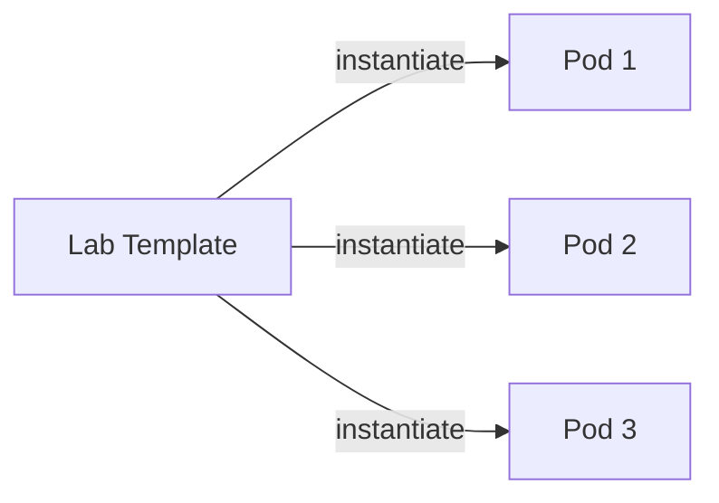

# Labs & Pods API

This section covers API endpoints for managing lab templates and pod instances.

## Labs Overview

**Lab templates** define the structure of a virtual environment. **Pods** are instances of these templates assigned to users.



---

## Lab Endpoints

### List Labs

<span class="api-method get">GET</span> `/api/v1/labs`

Get all available lab templates.

**Query Parameters:**

| Parameter | Type | Description |
|-----------|------|-------------|
| `platform` | string | Filter by platform (proxmox, cloudstack) |
| `active` | boolean | Filter by active status (default: true) |
| `difficulty` | string | Filter by difficulty level |

**Response (200 OK):**

```json
{
  "labs": [
    {
      "id": "550e8400-e29b-41d4-a716-446655440000",
      "name": "Linux Foundations",
      "description": "Introduction to Linux commands and system administration",
      "version": "1.0.0",
      "platform": "proxmox",
      "durationMinutes": 60,
      "difficulty": "beginner",
      "maxPoints": 100,
      "passThreshold": 70,
      "isActive": true,
      "createdAt": "2025-01-01T00:00:00Z"
    }
  ],
  "count": 1
}
```

---

### Get Lab

<span class="api-method get">GET</span> `/api/v1/labs/{labId}`

Get a specific lab template.

**Path Parameters:**

| Parameter | Type | Description |
|-----------|------|-------------|
| `labId` | uuid | Lab template ID |

**Query Parameters:**

| Parameter | Type | Description |
|-----------|------|-------------|
| `include_spec` | boolean | Include full YAML spec (default: false) |

**Response (200 OK):**

```json
{
  "id": "550e8400-e29b-41d4-a716-446655440000",
  "name": "Linux Foundations",
  "description": "Introduction to Linux commands",
  "version": "1.0.0",
  "platform": "proxmox",
  "durationMinutes": 60,
  "difficulty": "beginner",
  "maxPoints": 100,
  "passThreshold": 70,
  "isActive": true,
  "spec": {
    "vms": [...],
    "networks": [...]
  },
  "checkpoints": [
    {
      "id": "create-user",
      "name": "Create lab user",
      "description": "Create a user named 'labuser'",
      "points": 10
    }
  ]
}
```

---

### Get Lab Instructions

<span class="api-method get">GET</span> `/api/v1/labs/{labId}/instructions`

Get detailed instructions for a lab.

**Response (200 OK):**

```json
{
  "labId": "550e8400-e29b-41d4-a716-446655440000",
  "labName": "Linux Foundations",
  "overview": "In this lab, you will learn fundamental Linux commands...",
  "learningObjectives": [
    "Navigate the Linux filesystem",
    "Manage users and permissions",
    "Install and configure software"
  ],
  "prerequisites": [
    "Basic computer skills",
    "Understanding of command line concepts"
  ],
  "steps": [
    {
      "title": "Step 1: Connect to the VM",
      "content": "Use the console to connect to your Linux VM...",
      "hints": ["Use the default credentials", "Try the whoami command"]
    }
  ],
  "summary": "You learned how to...",
  "tips": ["Use tab completion", "Check command history with 'history'"],
  "resources": [
    {
      "title": "Linux Command Reference",
      "url": "https://linux.die.net/man/"
    }
  ]
}
```

---

### Create Lab (Admin)

<span class="api-method post">POST</span> `/api/v1/labs`

Create a new lab template. Requires admin or instructor role.

**Request Body:**

```json
{
  "name": "Network Security Basics",
  "description": "Learn firewall configuration and network security",
  "version": "1.0.0",
  "platform": "proxmox",
  "durationMinutes": 90,
  "difficulty": "intermediate",
  "maxPoints": 100,
  "passThreshold": 70,
  "spec": "apiVersion: v1\nkind: LabTemplate\n...",
  "isActive": true,
  "visibility": "global"
}
```

**Response (201 Created):**

```json
{
  "id": "new-lab-uuid",
  "name": "Network Security Basics",
  "slug": "network-security-basics",
  "createdAt": "2025-01-15T10:00:00Z"
}
```

---

### Update Lab (Admin)

<span class="api-method put">PUT</span> `/api/v1/labs/{labId}`

Update an existing lab template.

**Request Body:**

```json
{
  "name": "Updated Lab Name",
  "description": "Updated description",
  "isActive": false
}
```

---

### Delete Lab (Admin)

<span class="api-method delete">DELETE</span> `/api/v1/labs/{labId}`

Delete a lab template. Cannot delete if pods exist.

**Response (200 OK):**

```json
{
  "message": "Lab template deleted successfully"
}
```

---

## Pod Endpoints

### List Pods

<span class="api-method get">GET</span> `/api/v1/pods`

Get all pods for the current user.

**Query Parameters:**

| Parameter | Type | Description |
|-----------|------|-------------|
| `owner` | string | Filter by owner |
| `platform` | string | `proxmox` or `cloudstack` |
| `all` | bool | Include pods beyond the caller's own, subject to permissions |

**Response (200 OK):**

A `pods` array of full `models.Pod` objects — the same shape as
[Get Pod](#get-pod) below, so the same field-name corrections apply
(`labTemplate` not `labName`, `networks` array, `platformId` / `ipAddress`):

```json
{
  "pods": [
    {
      "id": "pod-abc123",
      "name": "cryptic-waddling-rain",
      "labTemplateId": "lab-uuid",
      "labTemplate": "Linux Foundations",
      "platform": "proxmox",
      "ownerId": "user-uuid",
      "owner": "jsmith",
      "status": "running",
      "vms": [
        {
          "name": "student-vm",
          "platformId": "100",
          "platform": "proxmox",
          "status": "running",
          "ipAddress": "10.0.100.10"
        }
      ],
      "networks": [],
      "createdAt": "2025-01-15T10:00:00Z",
      "expiresAt": "2025-01-15T14:00:00Z"
    }
  ]
}
```

There is no pagination on this endpoint and no `count` field.

---

### Create Pod

<span class="api-method post">POST</span> `/api/v1/pods`

Create a new pod from a lab template.

**Request Body:**

The handler declares exactly two fields, and **both are required**
(`api/internal/server/pods/handlers.go:47-50`). There is no `labTemplateId` field and no
`name` field — the pod name is generated server-side:

```json
{
  "labTemplate": "linux-basics-101",
  "owner": "jsmith"
}
```

A missing field returns 400 with per-field detail, keyed by the JSON tag:

```json
{
  "error": "validation failed",
  "details": [
    { "field": "labTemplate", "message": "..." },
    { "field": "owner", "message": "..." }
  ]
}
```

**Response (201 Created):**

The full `models.Pod` object, unwrapped:

```json
{
  "id": "pod-xyz789",
  "name": "cryptic-waddling-rain",
  "labTemplateId": "550e8400-e29b-41d4-a716-446655440000",
  "labTemplate": "linux-basics-101",
  "platform": "proxmox",
  "ownerId": "user-uuid",
  "owner": "jsmith",
  "status": "provisioning",
  "vms": [],
  "networks": [],
  "createdAt": "2025-01-15T10:00:00Z",
  "expiresAt": "2025-01-15T14:00:00Z"
}
```

**Other statuses:** 400 if the template is inactive, 404 if the template is not found,
503 if the template or user repository is not wired up.

:::note Async provisioning
Pod creation returns before the VMs exist. Poll `GET /api/v1/pods/{podID}` or subscribe to
the `pod_provisioning` WebSocket event (see [WebSocket Events](websocket.md)).

For a non-blocking create, `POST /api/v1/pods/async` returns **202** immediately with
`{podId, requestId, status, subject, message}`, where `subject` is the NATS subject
carrying progress.
:::

---

### Get Pod

<span class="api-method get">GET</span> `/api/v1/pods/{podID}`

Get detailed information about a pod.

**Response (200 OK):**

The bare `models.Pod` object — no wrapper. Note `networks` is an **array**, not a singular
`network` object, and the VM fields are `platformId` / `ipAddress`, not `vmid` / `ip`. There
is no `labName` field; the display name is `labTemplate`
(`api/internal/models/pod.go:7-59`):

```json
{
  "id": "pod-xyz789",
  "name": "cryptic-waddling-rain",
  "labTemplateId": "lab-uuid",
  "labTemplate": "Linux Foundations",
  "platform": "proxmox",
  "ownerId": "user-uuid",
  "owner": "jsmith",
  "status": "running",
  "vms": [
    {
      "name": "student-vm",
      "platformId": "100",
      "platform": "proxmox",
      "node": "pve1",
      "status": "running",
      "ipAddress": "10.0.100.10",
      "currentSnapshot": "initial"
    }
  ],
  "networks": [
    {
      "name": "lab-net",
      "platformId": "vmbr100",
      "vlan": 100,
      "subnet": "10.0.100.0/24",
      "gateway": "10.0.100.1",
      "netmask": "255.255.255.0",
      "type": "isolated"
    }
  ],
  "createdAt": "2025-01-15T10:00:00Z",
  "expiresAt": "2025-01-15T14:00:00Z",
  "organizationId": null,
  "teamId": null
}
```

`status` is one of `provisioning`, `running`, `stopped`, `error`, `destroying`, `destroyed`.
VM memory, core count and base template are properties of the **lab template**, not of the
pod response.

**Other statuses:** 404 not found, 403 access denied.

---

### Delete Pod

<span class="api-method delete">DELETE</span> `/api/v1/pods/{podID}`

Delete a pod and all its VMs.

**Response (200 OK):**

The body is a single field, and the value is `destroyed` — not `destroying`, and there is
no `message` field (`api/internal/server/pods/handlers.go:533`):

```json
{
  "status": "destroyed"
}
```

The response is **200 with a body**, not 204. Failures: 404 not found, 403 if the caller
may not delete this pod.

---

### Pod Lifecycle Operations

#### Start Pod

<span class="api-method post">POST</span> `/api/v1/pods/{podID}/start`

Start all VMs in the pod.

#### Stop Pod

<span class="api-method post">POST</span> `/api/v1/pods/{podID}/stop`

Stop all VMs in the pod.

#### Reset Pod

<span class="api-method post">POST</span> `/api/v1/pods/{podID}/reset`

Reset pod to initial snapshot state.

**Query Parameters:**

| Parameter | Type | Description |
|-----------|------|-------------|
| `snapshot` | string | Snapshot name (default: "initial") |

---

### VM Operations

#### Start VM

<span class="api-method post">POST</span> `/api/v1/pods/{podID}/vms/{vmName}/start`

Start a specific VM.

#### Stop VM

<span class="api-method post">POST</span> `/api/v1/pods/{podID}/vms/{vmName}/stop`

Stop a specific VM.

#### Reset VM

<span class="api-method post">POST</span> `/api/v1/pods/{podID}/vms/{vmName}/reset`

Reset a specific VM to snapshot.

---

### VM Console

<span class="api-method get">GET</span> `/api/v1/pods/{podID}/vms/{vmName}/console`

Get VNC console connection information.

**Response (200 OK):**

```json
{
  "type": "vnc",
  "host": "proxmox.local",
  "port": 5900,
  "ticket": "vnc-ticket-abc123",
  "websocketUrl": "wss://api.example.com/api/v1/pods/pod-xyz/vms/student-vm/vnc"
}
```

#### WebSocket VNC Proxy

<span class="api-method get">GET</span> `/api/v1/pods/{podID}/vms/{vmName}/vnc`

WebSocket endpoint for VNC proxy. Use with noVNC client.

---

### Pod Topology

<span class="api-method get">GET</span> `/api/v1/pods/{podID}/topology`

Get network topology visualization data.

**Response (200 OK):**

```json
{
  "podId": "pod-xyz789",
  "labTemplate": "Linux Foundations",
  "segments": [
    {
      "name": "internal",
      "vlan": 100,
      "subnet": "10.0.100.0/24",
      "gateway": "10.0.100.1",
      "dhcp": true
    }
  ],
  "vms": [
    {
      "name": "student-vm",
      "platformId": "vm-100",
      "status": "running",
      "ipAddress": "10.0.100.10",
      "template": "ubuntu-22.04",
      "networks": [
        {
          "segment": "internal",
          "ip": "10.0.100.10"
        }
      ],
      "resources": {
        "cpu": 2,
        "memory": 2048,
        "disk": 32
      }
    }
  ]
}
```

---

## Error Responses

| Status | Error | Meaning |
|--------|-------|---------|
| 400 | `invalid_request` | Bad request parameters |
| 401 | `unauthorized` | Authentication required |
| 403 | `forbidden` | Not allowed for this resource |
| 404 | `not_found` | Lab or pod not found |
| 409 | `conflict` | Pod already exists or in use |
| 503 | `service_unavailable` | Proxmox unavailable |
