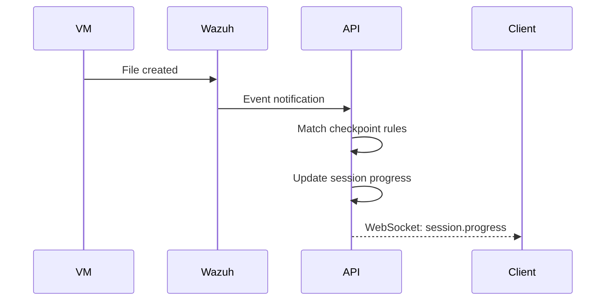

# Sessions API

This section covers API endpoints for managing lab sessions, tracking progress, and submitting for grading.

## Sessions Overview

A **session** tracks a user's attempt at completing a lab. Sessions include:

- Checkpoint progress
- Time tracking
- Scoring and grading
- Canvas LMS integration

---

## Session Endpoints

### List Sessions

<span class="api-method get">GET</span> `/api/v1/sessions`

Get all sessions for the current user.

**Query Parameters:**

| Parameter | Type | Description |
|-----------|------|-------------|
| `status` | string | Filter by status (active, ended, graded) |
| `labId` | uuid | Filter by lab template |
| `limit` | int | Results per page (default: 50) |
| `offset` | int | Pagination offset |

**Response (200 OK):**

```json
{
  "sessions": [
    {
      "id": "sess-abc123",
      "podId": "pod-xyz789",
      "labTemplateId": "lab-uuid",
      "labName": "Linux Foundations",
      "status": "active",
      "startedAt": "2025-01-15T10:00:00Z",
      "earnedPoints": 45,
      "maxPoints": 100,
      "passed": false
    }
  ],
  "total": 1
}
```

---

### Create Session

<span class="api-method post">POST</span> `/api/v1/sessions`

Start a new lab session for a pod.

**Request Body:**

Three fields are required, not one — `podId`, `userId` **and** `labTemplate`. They are
checked by hand rather than by validator tags, and each missing field produces its own 400
(`api/internal/server/sessions/handlers.go:363-373`):

```json
{
  "podId": "pod-xyz789",
  "userId": "user-uuid",
  "labTemplate": "linux-basics-101"
}
```

`userId` is required in the body and then **overwritten with the authenticated caller's ID**
(`handlers.go:319-323`), so you cannot start a session on another user's behalf by setting
it. Send your own.

Optional Canvas-linking fields: `canvasAssignmentId`, `canvasCourseId`, `canvasUserId`,
`enrollmentId`, `moduleId`.

**Response (201 Created):**

Not the session object — a small acknowledgement (`handlers.go:56-61`):

```json
{
  "sessionId": "sess-abc123",
  "status": "started",
  "maxPoints": 100,
  "agentStatus": { }
}
```

**Other statuses:** 400 for each missing required field; **409** if a live session already
exists for that pod.

---

### Get Session

<span class="api-method get">GET</span> `/api/v1/sessions/{sessionId}`

Get detailed session information.

**Response (200 OK):**

```json
{
  "id": "sess-abc123",
  "podId": "pod-xyz789",
  "labTemplateId": "lab-uuid",
  "labName": "Linux Foundations",
  "status": "active",
  "startedAt": "2025-01-15T10:00:00Z",
  "endedAt": null,
  "dueAt": "2025-01-15T14:00:00Z",
  "earnedPoints": 45,
  "maxPoints": 100,
  "percentage": 45.0,
  "passed": false,
  "passThreshold": 70,
  "checkpointProgress": {
    "completed": 3,
    "total": 7
  }
}
```

---

### Get Session Progress

<span class="api-method get">GET</span> `/api/v1/sessions/{sessionId}/progress`

Get current progress with checkpoint details.

**Response (200 OK):**

```json
{
  "sessionId": "sess-abc123",
  "earnedPoints": 45,
  "maxPoints": 100,
  "percentComplete": 45,
  "checkpoints": [
    {
      "id": "create-user",
      "name": "Create lab user",
      "description": "Create a user account named 'labuser'",
      "points": 10,
      "earnedPoints": 10,
      "status": "passed",
      "completedAt": "2025-01-15T10:15:00Z"
    },
    {
      "id": "install-nginx",
      "name": "Install Nginx",
      "description": "Install the Nginx web server",
      "points": 15,
      "earnedPoints": 15,
      "status": "passed",
      "completedAt": "2025-01-15T10:20:00Z"
    },
    {
      "id": "configure-firewall",
      "name": "Configure firewall",
      "description": "Allow HTTP traffic through the firewall",
      "points": 20,
      "earnedPoints": 20,
      "status": "passed",
      "completedAt": "2025-01-15T10:30:00Z"
    },
    {
      "id": "deploy-app",
      "name": "Deploy application",
      "description": "Deploy the sample web application",
      "points": 30,
      "earnedPoints": 0,
      "status": "pending"
    },
    {
      "id": "verify-access",
      "name": "Verify connectivity",
      "description": "Confirm the application is accessible",
      "points": 25,
      "earnedPoints": 0,
      "status": "pending"
    }
  ]
}
```

**Checkpoint Status Values:**

| Status | Description |
|--------|-------------|
| `pending` | Not yet completed |
| `passed` | Successfully completed |
| `failed` | Attempted but failed |
| `partial` | Partially completed |
| `skipped` | Not applicable |

---

### Get Checkpoints

<span class="api-method get">GET</span> `/api/v1/sessions/{sessionId}/checkpoints`

Get detailed checkpoint status.

**Response (200 OK):**

```json
{
  "checkpoints": [
    {
      "id": "create-user",
      "name": "Create lab user",
      "description": "Create a user account named 'labuser'",
      "points": 10,
      "earnedPoints": 10,
      "status": "passed",
      "completedAt": "2025-01-15T10:15:00Z",
      "trigger": {
        "type": "user_created",
        "params": {
          "username": "labuser"
        }
      },
      "feedback": "User 'labuser' created successfully"
    }
  ]
}
```

---

### End Session

<span class="api-method post">POST</span> `/api/v1/sessions/{sessionId}/end`

End a session without submitting for grading.

**Response (200 OK):**

```json
{
  "sessionId": "sess-abc123",
  "status": "ended",
  "endedAt": "2025-01-15T11:30:00Z",
  "earnedPoints": 45,
  "maxPoints": 100
}
```

---

### Submit Session

<span class="api-method post">POST</span> `/api/v1/sessions/{sessionId}/submit`

Submit session for grading and Canvas grade sync.

**Response (200 OK):**

```json
{
  "sessionId": "sess-abc123",
  "status": "graded",
  "earnedPoints": 75,
  "maxPoints": 100,
  "percentage": 75.0,
  "passed": true,
  "passThreshold": 70,
  "checkpoints": [
    {
      "id": "create-user",
      "description": "Create lab user",
      "points": 10,
      "earnedPoints": 10,
      "passed": true,
      "completedAt": "2025-01-15T10:15:00Z"
    }
  ],
  "submittedAt": "2025-01-15T11:35:00Z",
  "achievements": [
    {
      "id": "ach-first-lab",
      "achievementId": "first-lab",
      "name": "First Lab Complete",
      "tier": "bronze",
      "points": 10,
      "earnedAt": "2025-01-15T11:35:00Z"
    }
  ],
  "achievementsPending": false,
  "gradeSyncStatus": "synced"
}
```

**Response Fields:**

| Field | Description |
|-------|-------------|
| `achievements` | Achievements earned (if sync evaluation) |
| `achievementsPending` | True if achievements evaluated async |
| `gradeSyncStatus` | Canvas sync status |

---

## Canvas Grade Sync

When sessions are submitted for Canvas-linked assignments, grades are automatically synced.

### Grade Sync Status

| Status | Description |
|--------|-------------|
| `synced` | Grade sent to Canvas |
| `pending` | Awaiting sync |
| `failed` | Sync failed (will retry) |
| `not_linked` | No Canvas association |

:::danger There is no manual resync endpoint
This page used to document `POST /api/v1/sessions/{sessionId}/resync-grade`. **It does not
exist and never did** — the string `resync` appears nowhere in the Go module, tests
included. The session routes are fully enumerated at
`api/internal/server/sessions/manager.go:131-158`.

Grade sync is driven by session submission. Since LTI is gated off in this build (see
[Enterprise Edition](../enterprise.md)), nothing reaches Canvas regardless; the `grade`
WebSocket event still fires locally.
:::

---

## Session Events

Sessions emit events via WebSocket. The event `type` values are flat and underscored —
there are no dotted names like `session.progress`:

| `type` | Trigger | Distinguished by |
|--------|---------|------------------|
| `checkpoint` | A checkpoint was evaluated | `payload.action`: `passed`, `failed`, `reset`, `skipped` |
| `session` | Session lifecycle change | `payload.action`: `started`, `ended`, `paused`, `resumed`, `reset`, `submitted` |
| `grade` | Grade recalculated | — |

See [WebSocket Events](websocket.md) for payload shapes and the `{type, subject, payload}`
envelope.

---

## Checkpoint Detection

Checkpoints are detected automatically via Wazuh agents:



### Detection Latency

Checkpoint detection is near real-time:

| Step | Typical Latency |
|------|-----------------|
| Action to agent | < 1 second |
| Agent to API | < 2 seconds |
| API processing | < 500ms |
| Total | 2-5 seconds |

---

## Error Responses

| Status | Error | Meaning |
|--------|-------|---------|
| 400 | `invalid_request` | Bad request |
| 401 | `unauthorized` | Auth required |
| 403 | `forbidden` | Not your session |
| 404 | `not_found` | Session not found |
| 409 | `already_submitted` | Session already submitted |
| 409 | `session_active` | Session already exists for pod |
