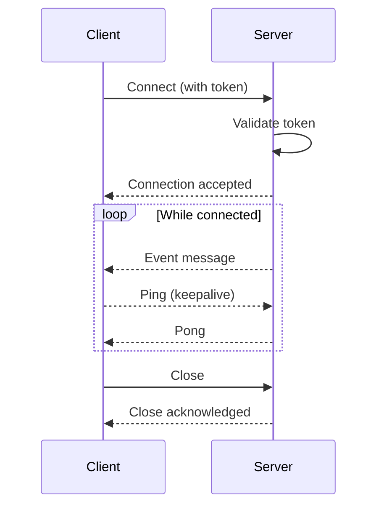

# WebSocket Events

Kootenai uses WebSocket connections for real-time updates. This document covers connection setup, event types, and message formats.

## Overview

WebSocket provides real-time updates for:

- Pod status changes
- VM state changes
- Checkpoint completions
- Achievement notifications
- System alerts

## Connecting

### General WebSocket

For user-wide notifications:

```
wss://api.example.com/ws
```

### Pod-Specific WebSocket

For pod-specific events:

```
wss://api.example.com/ws/{podId}
```

### Authentication

Include the JWT token in the connection:

=== "Query Parameter"
    ```
    wss://api.example.com/ws?token=eyJhbGciOiJIUzI1NiIs...
    ```

=== "Subprotocol"
    ```javascript
    const ws = new WebSocket(
      'wss://api.example.com/ws',
      ['access_token', 'eyJhbGciOiJIUzI1NiIs...']
    );
    ```

### Connection Lifecycle



## Message Format

All messages are JSON with this structure:

```json
{
  "type": "event_type",
  "timestamp": "2025-01-15T10:30:00Z",
  "data": {
    // Event-specific data
  }
}
```

## Event Types

### Pod Events

#### pod.status

Pod status changed:

```json
{
  "type": "pod.status",
  "timestamp": "2025-01-15T10:30:00Z",
  "data": {
    "podId": "pod-abc123",
    "previousStatus": "provisioning",
    "status": "running",
    "message": "Pod is ready"
  }
}
```

**Status Values:**

| Status | Description |
|--------|-------------|
| `provisioning` | Creating VMs |
| `running` | All VMs running |
| `stopped` | All VMs stopped |
| `error` | Provisioning failed |
| `destroying` | Being deleted |
| `destroyed` | Deleted |

#### pod.vm.status

Individual VM status changed:

```json
{
  "type": "pod.vm.status",
  "timestamp": "2025-01-15T10:30:05Z",
  "data": {
    "podId": "pod-abc123",
    "vmName": "student-vm",
    "previousStatus": "stopped",
    "status": "running",
    "ip": "10.0.100.10"
  }
}
```

#### pod.expiring

Pod expiration warning:

```json
{
  "type": "pod.expiring",
  "timestamp": "2025-01-15T10:30:00Z",
  "data": {
    "podId": "pod-abc123",
    "expiresAt": "2025-01-15T11:30:00Z",
    "minutesRemaining": 60
  }
}
```

---

### Session Events

#### session.progress

Checkpoint completed:

```json
{
  "type": "session.progress",
  "timestamp": "2025-01-15T10:35:00Z",
  "data": {
    "sessionId": "sess-xyz789",
    "podId": "pod-abc123",
    "checkpoint": {
      "id": "create-user",
      "name": "Create lab user",
      "points": 10
    },
    "totalEarned": 35,
    "totalPoints": 100,
    "percentComplete": 35
  }
}
```

#### session.submitted

Session submitted for grading:

```json
{
  "type": "session.submitted",
  "timestamp": "2025-01-15T11:00:00Z",
  "data": {
    "sessionId": "sess-xyz789",
    "podId": "pod-abc123",
    "earnedPoints": 85,
    "maxPoints": 100,
    "percentage": 85.0,
    "passed": true
  }
}
```

---

### Achievement Events

#### achievement.earned

New achievement unlocked:

```json
{
  "type": "achievement.earned",
  "timestamp": "2025-01-15T11:00:05Z",
  "data": {
    "achievementId": "first-lab",
    "name": "First Steps",
    "description": "Complete your first lab",
    "tier": "bronze",
    "points": 10,
    "icon": "pi-star"
  }
}
```

#### achievement.progress

Progress toward an achievement:

```json
{
  "type": "achievement.progress",
  "timestamp": "2025-01-15T11:00:00Z",
  "data": {
    "achievementId": "lab-master",
    "name": "Lab Master",
    "currentProgress": 5,
    "requiredProgress": 10,
    "percentComplete": 50
  }
}
```

---

### System Events

#### system.maintenance

Scheduled maintenance notification:

```json
{
  "type": "system.maintenance",
  "timestamp": "2025-01-15T10:00:00Z",
  "data": {
    "scheduledAt": "2025-01-16T02:00:00Z",
    "estimatedDuration": "30m",
    "message": "Scheduled maintenance window"
  }
}
```

#### system.alert

System-wide alert:

```json
{
  "type": "system.alert",
  "timestamp": "2025-01-15T10:00:00Z",
  "data": {
    "severity": "warning",
    "message": "Proxmox cluster experiencing high load",
    "affectedServices": ["pod_provisioning"]
  }
}
```

---

## Client Implementation

### JavaScript Example

```javascript
class VLabWebSocket {
  constructor(apiUrl, token) {
    this.url = `${apiUrl.replace('http', 'ws')}/ws?token=${token}`;
    this.handlers = new Map();
    this.connect();
  }

  connect() {
    this.ws = new WebSocket(this.url);

    this.ws.onopen = () => {
      console.log('WebSocket connected');
      this.startHeartbeat();
    };

    this.ws.onmessage = (event) => {
      const message = JSON.parse(event.data);
      this.handleMessage(message);
    };

    this.ws.onclose = () => {
      console.log('WebSocket disconnected');
      this.stopHeartbeat();
      // Reconnect after delay
      setTimeout(() => this.connect(), 5000);
    };

    this.ws.onerror = (error) => {
      console.error('WebSocket error:', error);
    };
  }

  handleMessage(message) {
    const handler = this.handlers.get(message.type);
    if (handler) {
      handler(message.data, message.timestamp);
    }
  }

  on(eventType, callback) {
    this.handlers.set(eventType, callback);
  }

  startHeartbeat() {
    this.heartbeatInterval = setInterval(() => {
      if (this.ws.readyState === WebSocket.OPEN) {
        this.ws.send(JSON.stringify({ type: 'ping' }));
      }
    }, 30000);
  }

  stopHeartbeat() {
    if (this.heartbeatInterval) {
      clearInterval(this.heartbeatInterval);
    }
  }

  close() {
    this.stopHeartbeat();
    this.ws.close();
  }
}

// Usage
const ws = new VLabWebSocket('https://api.example.com', accessToken);

ws.on('pod.status', (data) => {
  console.log(`Pod ${data.podId} is now ${data.status}`);
});

ws.on('session.progress', (data) => {
  console.log(`Checkpoint completed! ${data.percentComplete}% done`);
});

ws.on('achievement.earned', (data) => {
  showNotification(`Achievement unlocked: ${data.name}!`);
});
```

### Vue Composable

```typescript
// useWebSocket.ts
import { ref, onMounted, onUnmounted } from 'vue';

export function useWebSocket(token: string) {
  const connected = ref(false);
  const events = ref<any[]>([]);
  let ws: WebSocket | null = null;

  const connect = () => {
    ws = new WebSocket(`wss://api.example.com/ws?token=${token}`);

    ws.onopen = () => {
      connected.value = true;
    };

    ws.onmessage = (event) => {
      const message = JSON.parse(event.data);
      events.value.push(message);
    };

    ws.onclose = () => {
      connected.value = false;
      setTimeout(connect, 5000);
    };
  };

  onMounted(connect);
  onUnmounted(() => ws?.close());

  return { connected, events };
}
```

---

## VNC Console WebSocket

For VM console access, a separate WebSocket proxy is available:

### Endpoint

```
wss://api.example.com/api/v1/pods/{podId}/vms/{vmName}/vnc
```

### Authentication

Same as other WebSocket endpoints (token in query or subprotocol).

### Protocol

The VNC WebSocket uses the binary WebSocket protocol compatible with noVNC:

1. Connect to WebSocket endpoint
2. API proxies connection to Proxmox VNC
3. Binary frames contain RFB protocol data
4. Use noVNC client library to render

### Example with noVNC

```javascript
import RFB from '@novnc/novnc';

const rfb = new RFB(
  document.getElementById('screen'),
  `wss://api.example.com/api/v1/pods/${podId}/vms/${vmName}/vnc?token=${token}`
);

rfb.scaleViewport = true;
rfb.resizeSession = true;
```

---

## Error Handling

### Connection Errors

| Error | Cause | Recovery |
|-------|-------|----------|
| 401 | Invalid/expired token | Refresh token and reconnect |
| 403 | Access denied to pod | Check permissions |
| 404 | Pod not found | Pod may be destroyed |
| 429 | Rate limited | Back off and retry |

### Error Message Format

```json
{
  "type": "error",
  "timestamp": "2025-01-15T10:30:00Z",
  "data": {
    "code": "AUTH_EXPIRED",
    "message": "Authentication token has expired"
  }
}
```

---

## Best Practices

### Connection Management

1. **Single connection per client** - Don't create multiple connections
2. **Heartbeat** - Send ping every 30s to keep connection alive
3. **Reconnection** - Implement exponential backoff
4. **Cleanup** - Close connection when leaving page

### Event Handling

1. **Idempotent handlers** - Events may be delivered more than once
2. **Order independence** - Don't assume event order
3. **Stale events** - Check timestamps for relevance
4. **Error boundaries** - Don't let handler errors kill connection
