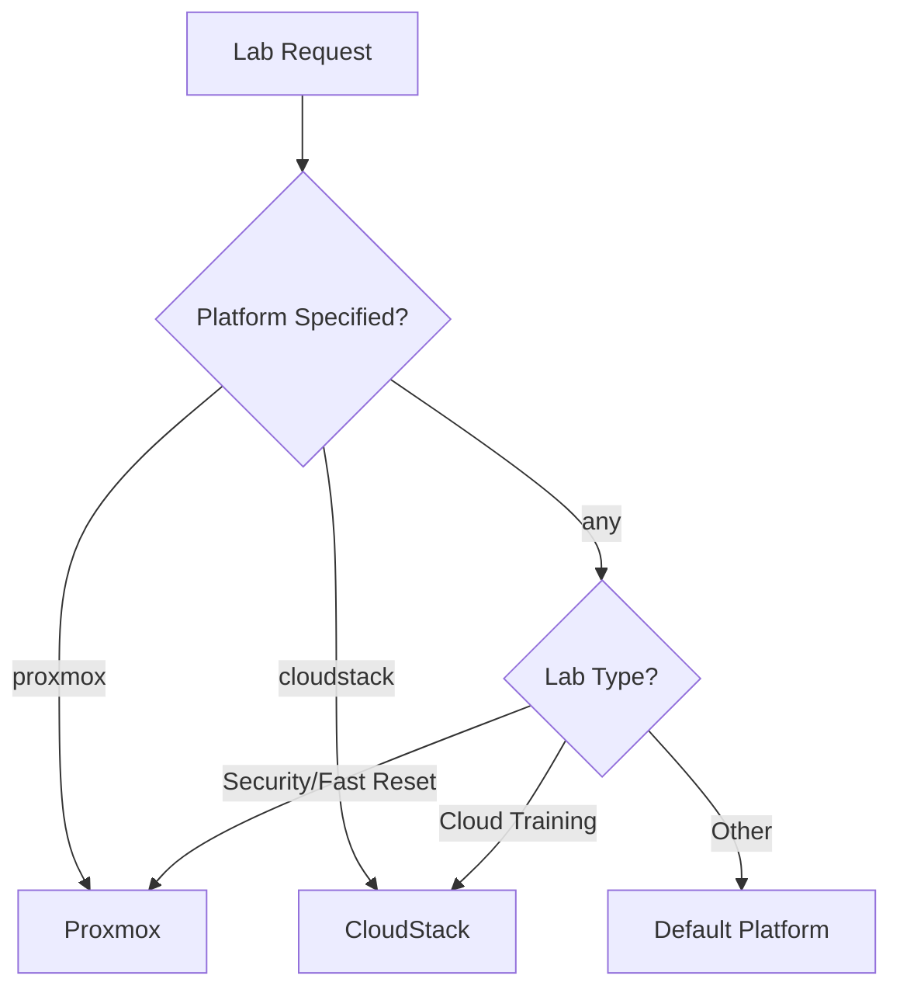
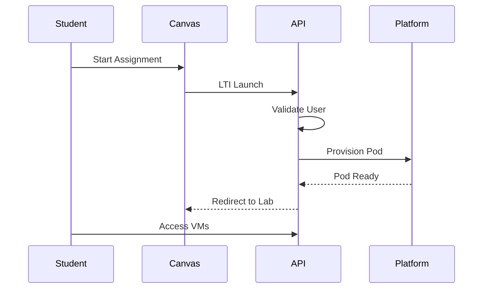

# Architecture Overview

## Platform Selection

The platform automatically selects the appropriate virtualization backend based on lab requirements:

## Components

### Go Orchestration API

The central service managing:

- Lab template loading and validation
- Pod lifecycle (create, monitor, destroy)
- Unified snapshot operations
- Authentication via FreeIPA
- Canvas LTI integration

### Vue.js Frontend

Student and instructor interface providing:

- Lab catalog browsing
- Pod management
- VM console access (VNC/SPICE)
- Snapshot controls
- Progress tracking and achievements
- Reservation scheduling

Built with Vue.js 3, Volt PrimeVue components, and Tailwind CSS v4. See [Frontend Architecture](frontend.md) for details.

### Python Utilities

Supporting tools for:

- Lab template parsing and validation
- Canvas integration helpers
- Automation scripts

## Data Flow

## Network Architecture

| VLAN | Subnet | Purpose |
|------|--------|---------|

