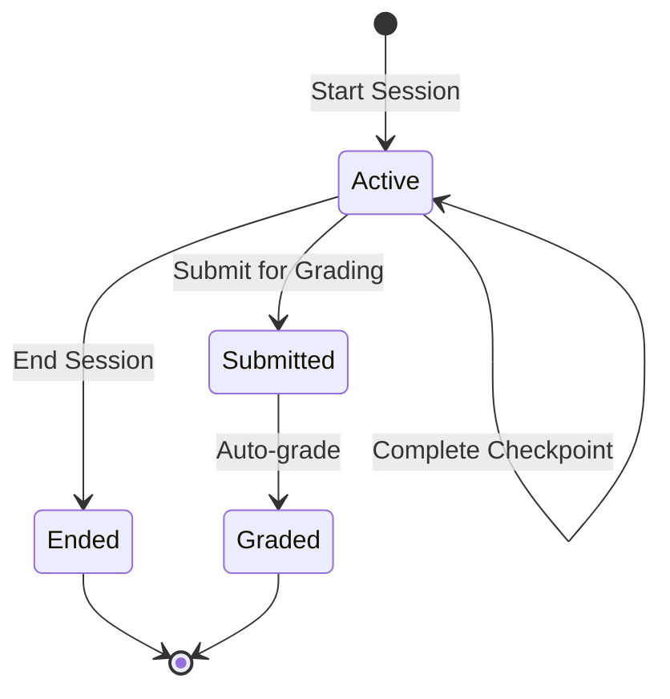
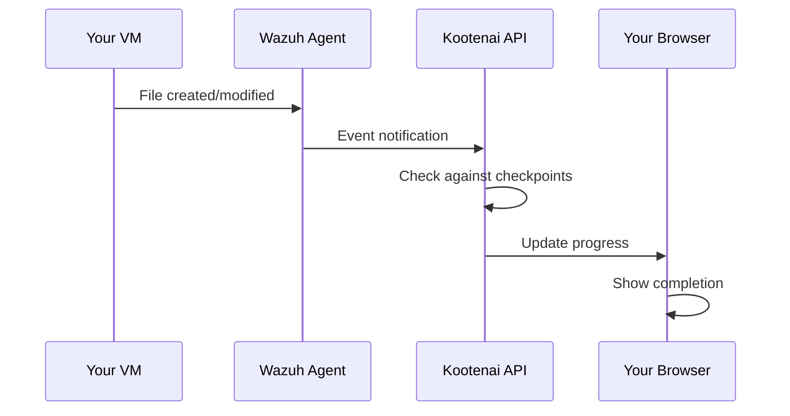

# Sessions & Progress

This guide explains how Kootenai tracks your progress through lab sessions, checkpoint completion, and grading.

## Understanding Sessions

A **session** represents your attempt at completing a lab. When you start working on a lab, a session is created to track:

- Time spent
- Checkpoints completed
- Points earned
- Submission status

### Session States



| State | Description |
|-------|-------------|
| **Active** | Currently working on the lab |
| **Ended** | Session closed without submission |
| **Submitted** | Submitted for grading |
| **Graded** | Grading complete, score assigned |

## Checkpoint System

### What are Checkpoints?

Checkpoints are specific objectives you need to complete in a lab. They're automatically detected by monitoring your VMs for:

- **File existence** - Creating specific files
- **File content** - Writing correct configurations
- **Package installation** - Installing required software
- **Service status** - Starting/configuring services
- **User accounts** - Creating users with correct permissions
- **Network configurations** - Setting up networking correctly

### How Detection Works

Kootenai uses [Wazuh agents](../admin/wazuh-integration.md) installed on VMs to detect changes:



### Viewing Checkpoints

See your checkpoint progress in the session panel:

1. Open your active pod
2. Look at the **Progress** section
3. Each checkpoint shows:
    - Description
    - Points value
    - Completion status
    - Time completed (if done)

## Tracking Progress

### Progress Panel

The progress panel shows:

```
┌─────────────────────────────────────────┐
│ Session Progress                    75% │
├─────────────────────────────────────────┤
│ ✓ Create user 'labuser'        10 pts  │
│ ✓ Install nginx                15 pts  │
│ ✓ Configure firewall           20 pts  │
│ ○ Deploy web application       30 pts  │
│ ○ Verify connectivity          25 pts  │
├─────────────────────────────────────────┤
│ Earned: 45 / 100 pts                    │
└─────────────────────────────────────────┘
```

### Real-time Updates

Progress updates automatically - no need to refresh. When you complete a checkpoint:

1. A notification appears
2. Progress bar updates
3. Points are added
4. Achievements may unlock

## Submitting Your Work

### When to Submit

Submit your session when you:

- Completed all required checkpoints
- Reached the passing threshold
- Want to record your current progress

### How to Submit

1. Click **Submit Session** in the progress panel
2. Confirm the submission
3. View your final score

!!! info "Canvas Integration"
    If your lab is linked to Canvas LMS, grades are automatically synced after submission.

### What Happens After Submission

1. **Score Calculation** - Points from completed checkpoints are totaled
2. **Pass/Fail Determination** - Compared against passing threshold
3. **Achievement Evaluation** - Any unlocked achievements are awarded
4. **Grade Sync** - Score sent to Canvas (if integrated)

## Grading

### Scoring

Each checkpoint has a point value. Your score is:

```
Score = (Completed Checkpoint Points) / (Total Available Points) × 100%
```

### Passing Threshold

Labs have a minimum passing score (typically 70%). Your result:

| Score | Result |
|-------|--------|
| ≥ Threshold | **Pass** |
| < Threshold | **Fail** |

### Partial Credit

Some checkpoints support partial credit:

- File exists but content is wrong = partial points
- Service running but misconfigured = partial points

## Tips for Success

### Before Starting

1. Read the lab instructions completely
2. Understand all checkpoint requirements
3. Note any prerequisites

### During the Lab

1. **Work systematically** - Complete checkpoints in order
2. **Check progress frequently** - Verify checkpoints register
3. **Take notes** - Document what you did
4. **Don't rush** - Accuracy matters more than speed

### If You're Stuck

1. Re-read the checkpoint description
2. Check for typos in file names/content
3. Verify services are running
4. Wait 30 seconds - detection may be delayed
5. Ask for help if needed

## Session History

View your past sessions:

1. Go to **My Sessions** or **History**
2. Filter by lab, date, or status
3. Click a session for details

Historical sessions show:

- Final score
- Time spent
- All checkpoint completions
- Submission timestamp

## Achievements

Completing labs can earn achievements:

- **First Lab** - Complete your first lab
- **Perfect Score** - Get 100% on any lab
- **Speed Demon** - Complete under time limit
- **Streak** - Complete labs on consecutive days

See [Achievement System](../achievement-system.md) for details.

## Troubleshooting

### Checkpoint Not Registering

If a checkpoint doesn't show as complete:

1. **Verify your work** - Did you complete it exactly as described?
2. **Check file permissions** - Can the agent read the file?
3. **Wait 30-60 seconds** - Detection isn't instant
4. **Refresh the page** - UI may need updating

### Score Seems Wrong

If your score doesn't match expectations:

1. Check which checkpoints are marked complete
2. Verify you submitted the correct session
3. Contact your instructor if discrepancy persists

### Can't Submit

If the submit button is disabled:

1. Ensure the session is still active
2. Check you haven't already submitted
3. Verify the pod is still running
