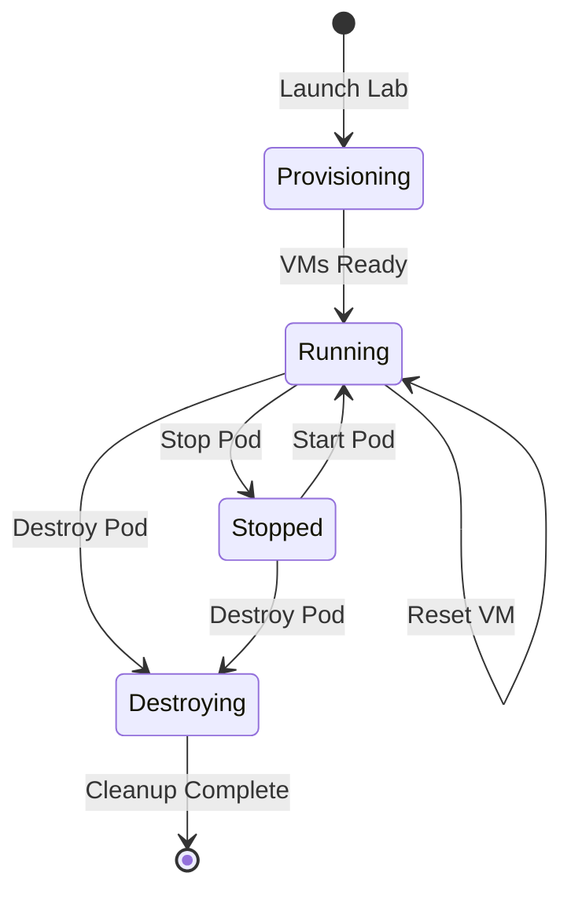

# Working with Pods

A **pod** is your personal instance of a lab environment. This guide covers everything you need to know about managing pods.

## Pod Lifecycle

## Creating a Pod

### From the Lab Catalog

1. Navigate to **Labs** in the main menu
2. Find a lab you want to work on
3. Click **Launch Lab**
4. Wait for provisioning (usually 1-2 minutes)

### Pod Naming

Pods are automatically named with the pattern: `{lab-name}-{random-id}`

Example: `linux-foundations-abc123`

## Accessing VMs

### Opening the Console

1. Go to **My Pods** to see your active pods
2. Click on a pod to view details
3. Click **Console** next to any VM

### Console Features

The browser-based VNC console provides:

| Feature | How to Use |
|---------|------------|
| Full terminal | Type directly in the console |
| Copy text | Select text, right-click → Copy |
| Paste text | Right-click → Paste |
| Send Ctrl+Alt+Del | Use toolbar button |
| Fullscreen | Press ++f11++ or toolbar button |

!!! tip "Keyboard Shortcuts"
    Most keyboard shortcuts work normally. If you need to send special keys like ++ctrl+c++ to the VM, just press them - they'll be forwarded.

## Managing Your Pod

### Starting and Stopping

You can start and stop individual VMs or the entire pod:

=== "Stop All VMs"
    Click **Stop** on the pod card to stop all VMs at once.

=== "Stop Single VM"
    In the pod detail view, click **Stop** next to a specific VM.

Stopped pods still consume resources but don't run. Use this for breaks.

### Resetting VMs

If you make a mistake, you can reset VMs to their initial state:

=== "Reset to Initial"
    Reverts the VM to the state when the pod was created.

=== "Reset to Checkpoint"
    If the lab has save points, you can reset to a specific checkpoint.

!!! warning "Data Loss"
    Resetting a VM will lose all changes made since the snapshot point. Save important work first.

### Destroying Pods

When you're done with a lab:

1. Go to **My Pods**
2. Click **Destroy** on the pod
3. Confirm the action

!!! danger "Permanent"
    Destroying a pod deletes all VMs and data permanently. This cannot be undone.

## Pod Expiration

Pods have automatic expiration to free up resources:

- Default: 24 hours after creation
- Can be extended if allowed
- Warning shown 1 hour before expiration

### Extending Pod Lifetime

If your instructor allows it:

1. Go to pod details
2. Click **Extend**
3. Choose extension duration

## Network Access

### Internal Networks

Each pod has isolated internal networks. VMs can communicate with each other within the pod but are isolated from other students' pods.

### Pod Network Diagram

View the network topology in the pod detail page:

- See how VMs are connected
- View IP addresses
- Understand the network segments

## Troubleshooting

### Pod Stuck in Provisioning

If a pod is stuck:

1. Wait at least 5 minutes
2. Try refreshing the page
3. If still stuck, destroy and recreate

### Can't Connect to Console

If the console doesn't load:

1. Check that the VM is running (status: `running`)
2. Refresh the page
3. Try a different browser
4. Clear browser cache

### VM Won't Start

If a VM fails to start:

1. Check the error message
2. Try resetting the VM
3. Contact your instructor if issues persist

## Best Practices

1. **Don't leave pods running** - Stop them when taking long breaks
2. **Destroy when done** - Free up resources for others
3. **Take notes** - Document your work before resetting
4. **Save progress** - Submit sessions before destroying pods

## Next Steps

- [Sessions & Progress](sessions-progress.md) - Track your checkpoints
- [Achievements](../achievement-system.md) - Earn badges and points
