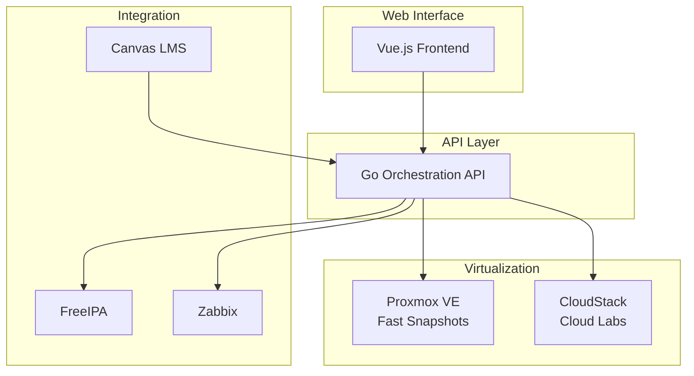

# Kootenai Platform

Welcome to the documentation for the Kootenai Platform, an open-source virtual lab environment for cybersecurity and network operations education.

## Overview

This platform orchestrates lab environments across both **Proxmox VE** and **Apache CloudStack** for academic institutions.

## Key Features

- **Hybrid Platform Support**: Use Proxmox for fast-snapshot labs, CloudStack for cloud training
- **YAML Lab Templates**: Define complex topologies declaratively
- **Canvas LMS Integration**: LTI 1.3 for assignment-linked provisioning
- **Snapshot Management**: Named reset points for easy lab resets
- **Network Isolation**: Per-pod VLAN segmentation

## Quick Links

- [Architecture Overview](architecture/overview.md)
- [Platform Comparison](architecture/platform-comparison.md)
- [Multi-Tenancy Plan](architecture/multi-tenancy-plan.md)

## Administration Guides

- [Proxmox Setup](admin/proxmox-setup.md)
- [Proxmox VM Templates](admin/proxmox-vm-templates.md)
- [Canvas LMS Integration](admin/canvas-lms-integration.md)
- [Wazuh Integration](admin/wazuh-integration.md)

## User Guides

- [Instructor Guide](instructor/guide.md)
- [First Lab Tutorial](tutorials/first-lab.md)

## Infrastructure

Configure your own infrastructure in `config.yaml`. Example services:

| Service | Description |
|---------|-------------|
| Proxmox VE | Virtualization platform for fast-snapshot labs |
| CloudStack | Cloud infrastructure for multi-tenant labs |
| FreeIPA/AD | Identity management (optional) |
| PostgreSQL | Database for platform state |
