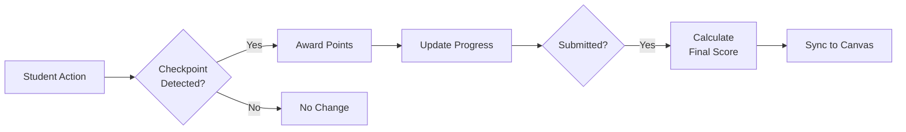

# Grading & Assessment

This guide explains Kootenai's grading system, assessment types, and Canvas LMS grade synchronization.

## Grading Overview

Kootenai uses automatic checkpoint-based grading:



## Checkpoint Grading

### How Points Work

Each checkpoint has a point value:

| Checkpoint | Points | Total |
|------------|--------|-------|
| Create user account | 10 | 10 |
| Install web server | 15 | 25 |
| Configure firewall | 20 | 45 |
| Deploy application | 30 | 75 |
| Verify connectivity | 25 | 100 |

### Scoring Calculation

```
Final Score = (Earned Points / Max Points) × 100%
```

**Example:**

- Completed: 3 of 5 checkpoints
- Earned: 45 points
- Maximum: 100 points
- Score: 45%

### Passing Threshold

Labs have a configurable passing threshold:

| Threshold | Common Use Case |
|-----------|-----------------|
| 50% | Participation credit |
| 70% | Standard assignment (default) |
| 80% | Mastery required |
| 100% | All checkpoints required |

## Assessment Types

### Lab Assessments

Standard labs with checkpoints:

- Auto-graded based on checkpoint completion
- Immediate feedback to students
- Multiple attempts allowed (configurable)

### Timed Assessments

Exams or quizzes with time limits:

- Clock starts when student begins
- Auto-submit when time expires
- Can disable pod reset during assessment

### Practical Exams

Comprehensive assessments:

- Combine multiple checkpoint types
- May include manual verification
- Often higher stakes (fewer attempts)

## Manual Grading

### When to Use

Manual grading is appropriate for:

- Complex outputs that can't be auto-detected
- Partial credit for close attempts
- Extra credit for exceptional work
- Adjustments for technical issues

### Adjusting Grades

1. Go to **Sessions** → **Find Session**
2. Click **Grade Adjustment**
3. Choose adjustment type:

| Type | Effect |
|------|--------|
| Add Points | Increase score |
| Remove Points | Decrease score |
| Override Score | Set specific score |
| Mark Checkpoint Complete | Award checkpoint manually |

4. Add a note explaining the adjustment
5. Save changes

### Grade History

All adjustments are logged:

```
Grade History for session: abc-123
─────────────────────────────────────────
2025-01-15 14:32  Auto: Checkpoint 1 complete     +10 pts
2025-01-15 14:45  Auto: Checkpoint 2 complete     +15 pts
2025-01-15 15:20  Manual: Partial credit for #3   +10 pts
                  Note: "Correct approach, minor syntax error"
2025-01-15 15:30  Auto: Submitted                 Final: 35/100
```

## Canvas Integration

### Automatic Grade Sync

When configured, grades sync automatically:

1. Student completes lab in Kootenai
2. Student clicks **Submit**
3. Score calculated
4. Grade sent to Canvas gradebook
5. Student sees grade in Canvas

### Grade Passback Details

Information sent to Canvas:

| Field | Value |
|-------|-------|
| Score | Percentage (0.0 - 1.0) |
| Timestamp | Submission time |
| Comment | Auto-generated summary |

### Sync Status

Check sync status in session details:

| Status | Meaning |
|--------|---------|
| `synced` | Grade successfully sent to Canvas |
| `pending` | Awaiting sync |
| `failed` | Sync failed (will retry) |
| `not_linked` | No Canvas association |

### Troubleshooting Sync

If grades aren't syncing:

1. **Check session link** - Verify student launched from Canvas
2. **Check Canvas assignment** - Ensure LTI tool is connected
3. **Check API connection** - Verify Canvas API token is valid
4. **Manual sync** - Click **Resync Grade** in session details

### Manual Grade Override in Canvas

If you adjust a grade in Canvas directly:

- Kootenai won't overwrite manual Canvas grades
- Student can still see their checkpoint progress in Kootenai
- Consider noting the discrepancy

## Assessment Reports

### Individual Reports

View detailed assessment for one student:

1. Go to student profile
2. Click **Assessment History**
3. View all sessions with:
    - Scores and dates
    - Time spent
    - Checkpoint details
    - Any adjustments

### Class Reports

Generate reports for entire teams:

1. Go to **Reports** → **Assessment**
2. Select:
    - Team(s)
    - Lab(s)
    - Date range
3. Choose metrics:
    - Scores
    - Completion rates
    - Time to completion
    - Attempt counts
4. Export as CSV/PDF

### Analytics

The analytics dashboard shows:

- **Score Distribution** - Histogram of scores
- **Completion Rates** - % of students completing each checkpoint
- **Time Analysis** - Average time per checkpoint
- **Difficulty Indicators** - Which checkpoints cause issues

## Configuring Assessments

### Lab-Level Settings

Configure in lab template:

```yaml
assessment:
  maxPoints: 100
  passThreshold: 70
  maxAttempts: 3          # 0 = unlimited
  timeLimit: 120          # minutes, 0 = no limit
  allowReset: true        # Can student reset VMs?
  showProgress: true      # Show checkpoint status during lab?
  showScore: true         # Show current score during lab?
```

### Checkpoint Settings

Configure individual checkpoints:

```yaml
checkpoints:
  - id: create-user
    name: Create lab user
    points: 10
    required: true        # Must complete to pass
    partialCredit: false  # All or nothing

  - id: configure-service
    name: Configure web service
    points: 25
    required: false
    partialCredit: true   # Can earn partial points
    partialThreshold: 50  # Minimum for partial credit
```

## Best Practices

### Setting Point Values

- **Weight by importance** - Critical skills = more points
- **Balance the lab** - No single checkpoint should dominate
- **Consider time** - Harder tasks may need more points
- **Round numbers** - Easier for students to track

### Setting Thresholds

- **70%** - Standard for most labs
- **Lower (50-60%)** - Learning/practice labs
- **Higher (80-90%)** - Assessment/certification

### Partial Credit

Use partial credit for:

- Complex multi-step checkpoints
- Tasks with multiple valid approaches
- Learning-focused (not assessment) labs

### Handling Issues

- **Technical problems** - Extend time or allow re-attempt
- **Ambiguous requirements** - Grant benefit of doubt
- **Widespread issues** - Consider curve or adjustment
- **Academic integrity** - Document and follow policy

## Related Topics

- [Managing Students](managing-students.md) - Student administration
- [Canvas LMS Integration](../admin/canvas-lms-integration.md) - Setup guide
- [Lab Template Guide](../lab-templates/template-creation-guide.md) - Creating labs
